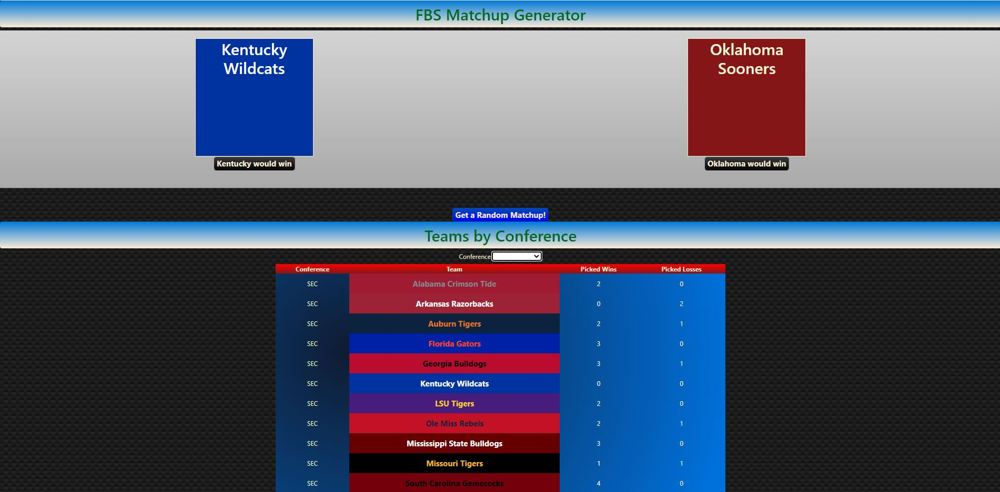

# NCAAF_Ultimate

- This application is a personally built out NCAA Football API with a few extra features built in.
Including:
1. Random Matchup Generator
2. Filter by Conference
3. Details of each team
4. Colored by team official colors.

Strong implementaion of OOP with RESTful backend routing.

- Front-End powered by **React.js** with a personal **CSS** stylesheet
- Back-End powered by **Node.js**, **Express.js**, and a **MongoDB** database.
(MERN Project)
